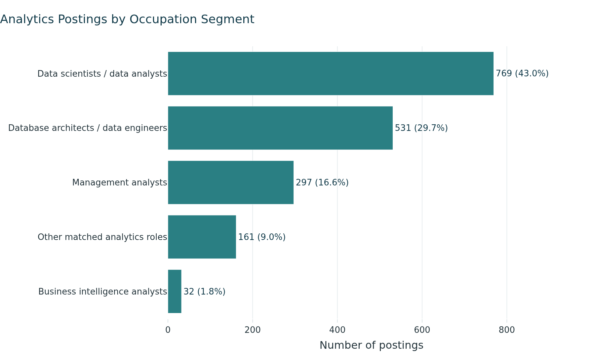
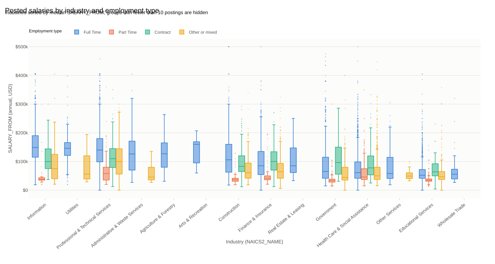

::: {.hero .column-screen}
```{=html}
<canvas id="hero-network" aria-hidden="true"></canvas>
<div class="hero-inner">
  <div class="hero-text">
    <p class="hero-hello">Hi There,</p>
    <h1 class="hero-name">I'm Juan <span class="accent">Franco</span></h1>
    <p class="hero-typing">I'm into <span class="typed" data-words="Data Analytics|Machine Learning|Cloud Analytics|Power BI Dashboards|Python and SQL"></span><span class="caret">|</span></p>
    <p class="hero-lead">Senior Data Analyst at Royal Caribbean Group and M.S. in Business Analytics
    candidate at Boston University. I turn large, messy operational data into dashboards, models
    and decisions, and I'm building toward a career in data science and machine learning.</p>
    <a class="btn btn-primary btn-glow" href="about.html">About Me <i class="bi bi-arrow-right-circle-fill"></i></a>
    <a class="btn btn-outline-primary" href="projects.html">View my projects</a>
    <div class="hero-social">
      <a href="https://www.linkedin.com/in/juansfrancoh" aria-label="LinkedIn"><i class="bi bi-linkedin"></i></a>
      <a href="https://github.com/JuanSFrancoH" aria-label="GitHub"><i class="bi bi-github"></i></a>
      <a href="mailto:jfran291@bu.edu" aria-label="Email"><i class="bi bi-envelope-fill"></i></a>
      <a href="files/Juan_Franco_CV.pdf" aria-label="Download CV"><i class="bi bi-file-earmark-person-fill"></i></a>
    </div>
  </div>
  <div class="hero-photo"></div>
</div>
```
:::

::: {.grid .stats}
::: {.g-col-6 .g-col-md-3 .stat}
[4+]{.stat-number} [years in analytics]{.stat-label}
:::
::: {.g-col-6 .g-col-md-3 .stat}
[3]{.stat-number} [companies across 2 industries]{.stat-label}
:::
::: {.g-col-6 .g-col-md-3 .stat}
[500K+]{.stat-number} [job postings processed with Spark]{.stat-label}
:::
::: {.g-col-6 .g-col-md-3 .stat}
[Oct 2026]{.stat-number} [M.S. in Business Analytics]{.stat-label}
:::
:::

## What I do

::: {.grid}
::: {.g-col-12 .g-col-md-4 .skill-card}
<i class="bi bi-cloud-arrow-up"></i>

### Data engineering and cloud

Building Spark pipelines on AWS, cleaning and reshaping large datasets, and
modeling data as star schemas that are easy to query.
:::
::: {.g-col-12 .g-col-md-4 .skill-card}
<i class="bi bi-bar-chart-line"></i>

### Analytics and BI

Designing Power BI and Tableau dashboards that teams use every week, with clear
KPIs, solid data models and trend and variance analysis.
:::
::: {.g-col-12 .g-col-md-4 .skill-card}
<i class="bi bi-cpu"></i>

### Machine learning

Training and tuning classification models such as KNN, decision trees and
random forests, with cross-validation and honest baselines.
:::
:::

## Featured projects

::: {.grid}
::: {.g-col-12 .g-col-md-6 .project-card}
{fig-alt="Bar chart of job posting volume by segment"}

### [Career Evaluation Website](projects/career-site.qmd)
A team-built site that helps analytics job seekers compare roles, salaries and
skill demand, powered by a pipeline I built on 504,208 job postings.
:::
::: {.g-col-12 .g-col-md-6 .project-card}
{fig-alt="Chart of salary by industry"}

### [Job Market Analytics with Apache Spark](projects/spark-job-market.qmd)
Star schemas, Spark SQL and PySpark cleaning on AWS EC2, with Plotly charts of
salary patterns by industry, education and experience.
:::
:::

[See all projects](projects.qmd){.btn .btn-primary}

## Recent focus

In Big Data and Cloud Analytics at Boston University, I used PySpark, AWS and
Spark ML to help build a team website that maps the job market for analytics
roles. At work, I'm automating more of our weekly planning data with Python.

```{=html}
<script src="js/hero.js"></script>
```
