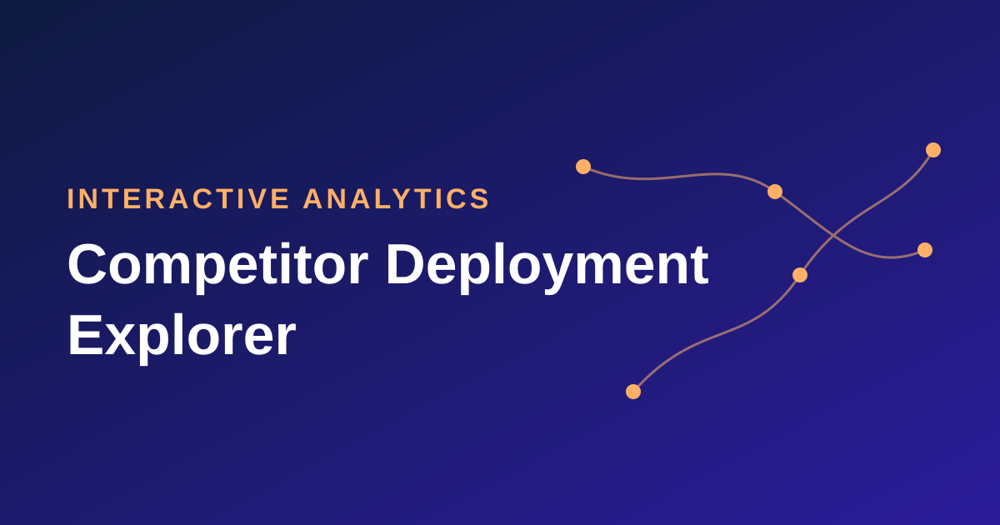

{fig-alt="Competitor Deployment Explorer title banner"}

::: {.project-facts}
**My role:** business questions, data rules, success criteria and validation 
**Data:** 101,067 port calls across 9,068 voyages, with about 900 geocoded ports 
**Tools:** [Python]{.tag} [pandas]{.tag} [JavaScript]{.tag} [D3.js]{.tag} [TopoJSON]{.tag} [HTML/CSS]{.tag} [Excel]{.tag} [PowerPoint]{.tag} [Playwright]{.tag} [UN/LOCODE]{.tag} [GeoNames]{.tag} [Claude]{.tag}
:::

## The problem

Our deployment team needed to understand how competitors use key regions, but
the source data was a flat table of 101,067 port-call rows across 9,068 voyages.
It had no coordinates or distances, port names were inconsistent and some ports
were miscoded. Answering questions like "what is each line's most common
turnaround pair in the Adriatic?" or "is this Panama Canal sailing a product or
a repositioning?" meant manual spreadsheet work.

## What it does

I built a tool with three views, all driven by one shared set of filters: year,
region, competitor, ship, itinerary, cruise ID, embark and debark port, open or
closed jaw, port, country, nights and date range.

- **Sailing Routes** plots any sailing on a map. Routes follow the sea around
  land and through canals and straits, and they respect real limits: ships too
  wide for the Corinth Canal go around the Peloponnese instead. A day-by-day
  panel shows ship size and estimated distances, and a "previous and next"
  overlay shows how each ship moves between deployments.
- **Pivot** works like an Excel pivot table in the browser. Any field can be a
  row or a column, measuring sailings, capacity (APCD), nights or distance as
  sums, averages or percentages, with CSV export.
- **Dashboard** shows six headline figures and eight interactive charts, such as
  capacity by competitor and seasonality by month. Clicking any bar or pivot
  cell filters the whole page.

## How I built it

- **Data pipeline (Python and pandas):** I rebuilt each sailing's stops from
  the raw port-call records and geocoded about 900 ports using our port table,
  the UN's register of port locations (UN/LOCODE) and GeoNames. When several
  places shared a name, I picked the one closest to the neighboring calls.
- **Data quality:** I added a plausibility check based on the speed a ship would
  need between two calls. It caught miscoded ports such as Trogir entered for
  Trondheim, Dublin for Dubrovnik, and Cartagena, Spain confused with
  Cartagena, Colombia. I log every correction.
- **Front end:** a single self-contained web page built with D3.js and TopoJSON,
  with a custom route-finding algorithm that steers around land. It works on
  desktop and mobile.
- **Business rules:** I defined the rules our team cares about: each line's
  most common turnaround pair, standalone versus repositioning sailings based
  on each ship's surrounding voyages, full versus half Panama Canal transits,
  Venice mid-cruise calls and a set of direct competitors.
- **Validation:** I cross-check every filter value and count against the
  companion Excel workbook, sailing by sailing. Pivot totals tie to the
  workbook, distances come from one shared calculation, and browser tests run
  automatically with Playwright.

## Results

- Questions about regions and competitors that used to take manual spreadsheet
  work now take a few clicks.
- I also delivered an Excel workbook with sailing-level data, day-by-day
  itineraries, ship specs, top turnaround pairs and the correction log, plus
  executive slides profiling each region by competitor: round trip versus open
  jaw, standalone versus repositioning, average length, ship size and most
  common turnaround pair.

## What I learned

I owned the business questions, data rules and success criteria, and I reviewed
every output against what I know from operations. That review caught issues
like unrealistic canal routings and misclassified sailings. I used Claude as a
coding assistant to speed up the build. My biggest takeaway: AI makes building
faster, but domain knowledge is what makes the results trustworthy.

*Details are kept general to protect company data.*

[Back to projects](../projects.qmd){.btn .btn-outline-secondary}
